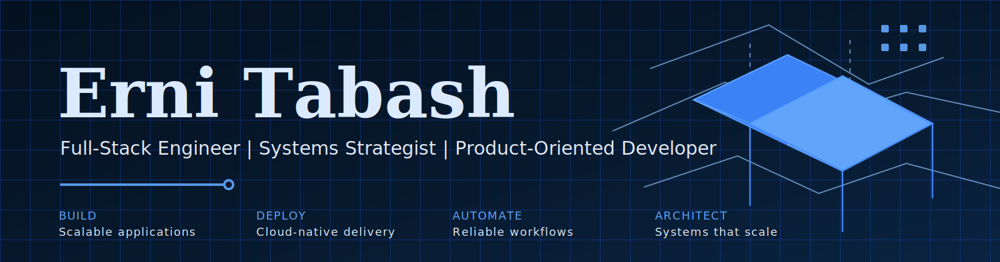

# Erni Tabash

**Full-Stack Engineer | Systems Strategist | Product-Oriented Developer**

I build practical software systems that connect business goals with scalable technical execution. My work spans full-stack web platforms, cloud-ready applications, automation pipelines, and product-focused architecture.

## Stack

  
  
  
  
  
  
  
  
  
  
  
  

## Current focus

- Building a local-first resume decision engine with Python and Rust
- Refining my personal landing page and technical brand
- Creating practical tools for job search automation and professional visibility
- Designing systems that are maintainable and aligned with real business outcomes

## Selected work

### Resume Pipeline OS

A local-first job application decision engine that evaluates raw job descriptions against a professional profile and generates tailored CV output only when the fit is strong.

**Focus:** Rust, Python, automation, decision logic, local processing

### Personal Landing

A React/Vite personal website focused on positioning, professional visibility, and technical branding.

**Focus:** React, TypeScript, Vite, UI structure, brand presentation

### Job Board MVP

A job board experiment for exploring recruiting workflows, job discovery, and lightweight product validation.

**Focus:** React, AWS Amplify, product validation, recruiting workflows

### White Label Backend

A reusable backend foundation for SaaS-style products, focused on authentication, APIs, database structure, and scalable service logic.

**Focus:** Backend architecture, API design, auth, platform foundations

### Premium Backend Auction

A backend auction system centered on business rules, service-layer design, and structured Java/Spring Boot architecture.

**Focus:** Java, Spring Boot, domain logic, service orchestration

## How I think

I care about solving the right problem before writing more code. Good software is context, architecture, execution, and measurable value.

## Contact

- Email: ernitabash01@gmail.com
- LinkedIn: https://www.linkedin.com/in/erni-tabash
- GitHub: https://github.com/IRUKEN